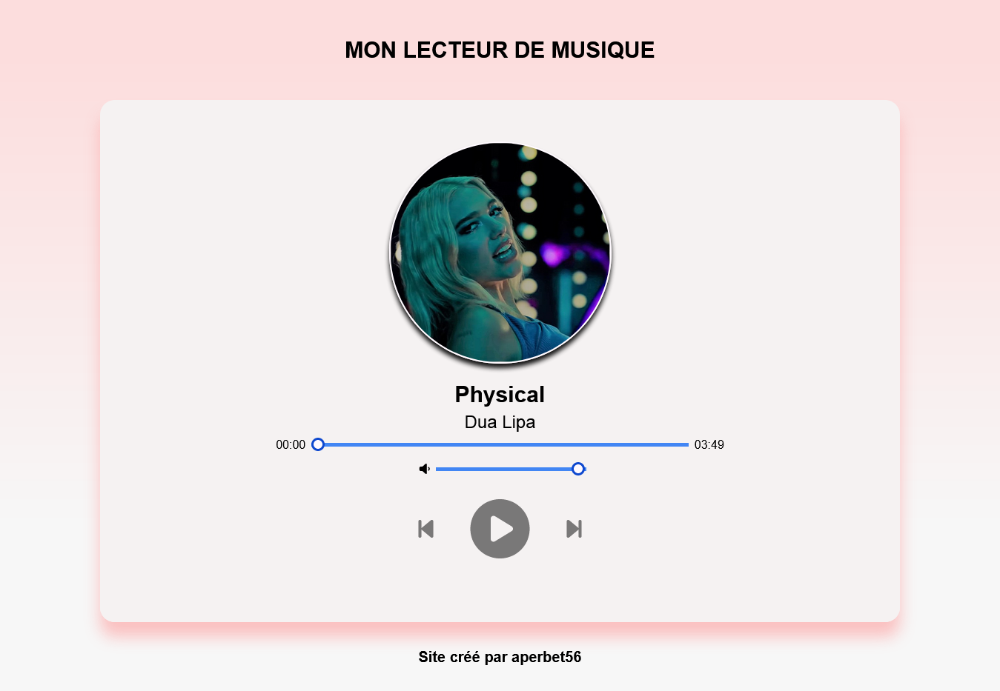
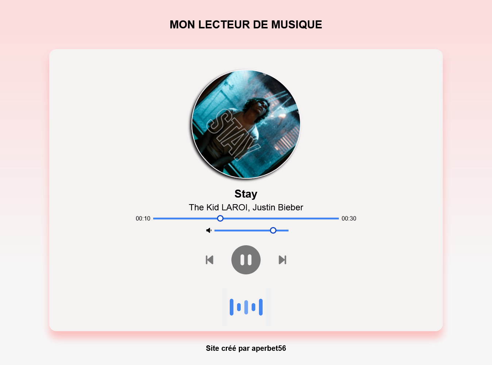

## LECTEUR DE MUSIQUE 🎶

## Le challenge

Ce site va permettre d'écouter de la musique dossier de musique. Ce projet présente plusieurs spécificités:

- image tournante dès que la chanson commence et image qui s'arrête de touner dès que la chanson est mise sur pause
- détails de la chanson (titre et artiste)
- barre de progression de la chanson
- possiblilité de réduire ou d'augmenter le son
- possiblilité de mettre sur pause et de jouer une chanson
- possibilité de revenir à la chanson précédente
- possiblité de passer à la chanson suivante

## Démonstration

Lien vers le projet : https://aperbet56.github.io/music_player/

## Projet développé avec

- Utilisations des balises sémantiques HTML5
- CSS3
- Flexbox
- Desktop first
- Animations CSS (transition, @keyframes...).
- Page web responsive
- Utilisation du normaliseur : le fichier normalize.css
- JavaScript
- Code JavaScript commenté
